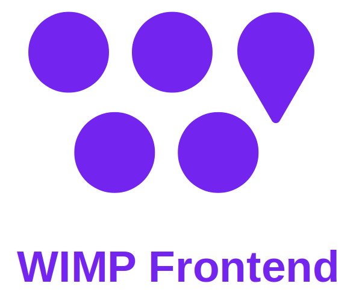

# WIMP Frontend

    

## What is the WIMP system ?

WIMP is an IoT system that allows the students to get their teachers availability in real time.

The goal of this project is also to offer a functional IoT system to the researchers of the lab for the experiments.

## What is the WIMP Frontend ?

The front part allows students and researchers to consult the availability of their teachers through a web interface.

Technically, the frontend part of the WIMP sytem is an Express.js web server with a simple-json-db database management and authentication with passport.js. This web server also communicates with the backend part of the system to get information about the status of the teachers.

This web server is used to host a website accessible from the global network. Each student must be logged to prove that he is a student and give his level of study. Once logged he can see the status of the teachers (if they are available or not).

Depending on their level of study, the students will see different information. For example, a researcher could have access to more precise information on a professor than a bachelor student.

## Learn more about the Frontend

To learn more about this part of the system, we invite you to consult its [documentation](https://ptidejteam.github.io/wimp-wiki/docs/frontend/intro).