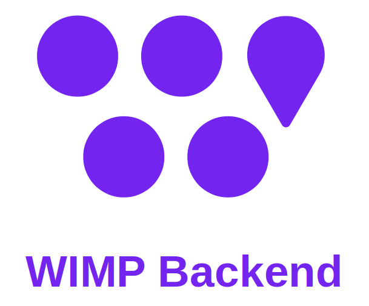

# WIMP-Project

The WIMP-Project is a comprehensive software system designed for real-time monitoring and user interaction within IoT environments. It focuses on optimizing the availability of teachers in educational settings and processing related data efficiently. The project is modular, with several branches representing different versions or specialized features.

<p align="center" style="margin: 50px 0">  <p>

## Branches Overview

The WIMP-Project is divided into several branches, each representing different versions of the project or specific areas of functionality:

- **Main:** The facade branch for the WIMP-Project. It integrates and presents the latest stable features from all other branches, providing a unified and production-ready version of the system. This branch serves as the primary interface for users and stakeholders, combining the best and most stable aspects of the project.
- **V1:** This branch contains the initial version of the WIMP system, providing basic functionality and architecture.
- **V2:** This branch includes improvements and new features over V1, with better performance and additional capabilities.
- **V3:** The latest major version with enhanced functionality, optimizations, and bug fixes. It is the most feature-complete version so far.
- **Wiki:** This branch hosts the documentation for the WIMP system, including detailed information about the architecture, deployment, and usage.
- **Kinova:** This branch focuses on integrating and managing Kinova robotics systems within the WIMP framework, aimed at specific IoT and robotic features.

Each branch serves a different purpose in the evolution and development of the WIMP system. To work on or review specific features, choose the relevant branch based on your needs.


## How to Get the Right Version

To ensure you're working with the correct version of the WIMP-Project, follow these steps:

### 1. Clone the Repository

Start by cloning the repository to your local machine:

```bash
git clone https://github.com/yourusername/WIMP-Project.git
```

### 2. Navigate to the Project Directory

Move into the newly cloned directory:

```bash
cd WIMP-Project
```

### 3. List Available Branches

Check which branches are available in the repository:

```bash
git branch -a
```

This command will list all branches, including remote branches that you can check out.

### 4. Checkout the Desired Branch

To work with a specific branch, use the following command:

```bash
git checkout <branch-name>
```

Replace `<branch-name>` with the name of the branch you wish to check out (e.g., `development`, `feature-X`).

### 5. Pull the Latest Changes (Optional)

If you want to ensure you have the most up-to-date version of the branch, pull the latest changes from the remote repository:

```bash
git pull origin <branch-name>
```

### 6. Build and Run the Project

Refer to the project's build instructions in the `README.md` or `BUILD.md` file. Follow the steps outlined there to compile and run the project on your system.

## Development Guidelines

### 1. Always Include a `README.md`

For each new version or feature branch, developers must include an updated `README.md` file. This file should:

- Clearly describe the purpose and scope of the version or feature.
- List any prerequisites for running the project.
- Provide step-by-step instructions for installation, setup, and usage.

### 2. Include Build Instructions

In addition to the `README.md`, ensure that a `BUILD.md` file (or a dedicated section within the `README.md`) is included with:

- Detailed instructions on how to compile and build the project.
- Any environment variables, dependencies, or tools needed to build the project.
- Instructions for running tests and verifying that the build is successful.

### 3. Maintain Branch Consistency

When creating new branches, ensure that the `README.md` and build instructions are consistent and reflect any changes made in that branch. This helps maintain clarity and usability across all versions of the project.

### 4. Documentation Updates

Whenever a new feature is added or a significant change is made, update the documentation accordingly. This includes adding new sections to the `README.md` or revising existing instructions to reflect changes.

## Contributing

If you wish to contribute to the WIMP-Project, please follow these guidelines:

1. **Fork the Repository:**
   Create your own fork of the repository by clicking the "Fork" button on the GitHub page.

2. **Create a New Branch:**
   Create a new branch for your feature or bug fix:
   ```bash
   git checkout -b feature/your-feature-name
   ```

3. **Commit Your Changes:**
   Make sure to commit your changes with a clear and descriptive commit message:
   ```bash
   git commit -m "Add your descriptive commit message here"
   ```

4. **Push to Your Fork:**
   Push your branch to your forked repository:
   ```bash
   git push origin feature/your-feature-name
   ```

5. **Submit a Pull Request:**
   Open a pull request on the original repository, describing your changes and why they should be merged.


## Contact

For any questions or issues, please contact the project maintainers.
