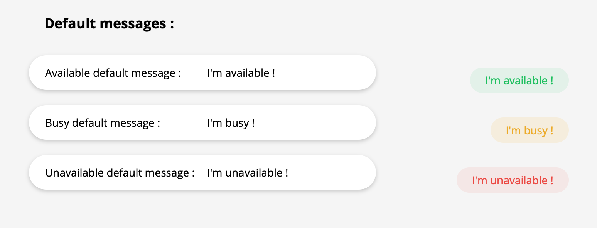

# Front-Backend
As seen in <a href="./back-backend#recieve-request">back-backend#recieve-request</a> the server transforms data received from node-red into displayable data (color, text).
To do this the server matches the raw data to the sentence and color that the teacher has chosen. 

Example : <br/>
node-red side -> _when my plug is connected I generate the availability status **1**_<br/>
express side -> _for me the state 1 corresponds to **"I am available"** in **green**_

However, to do this, express must retrieve its own information from a database, its why the front-backend (graphical interface) is necessary to allow teachers to modify their messages, add states, change the color of some messages etc...


## Needs: 

After discussion we have established 3 needs:

- to be able to match a specific state (from node-red) to a certain message 
- to be able to manage the visibility of the messages according to the students level/role
- to be able to disabled its presence on the site (to be in an "Disconnected" message no matter what information the devices sent)

### to be able to match a specific message to a certain state
Chaque etat brute renvoyé par node-red doit avoir un corespondance propre constitué d'un message et d'une coleur d'affichage
```json
// database/staff.json
"id professeur": {
    ...
    "states": {
        "1": {
            "msg": "in his office but busy",
            "color": "orange",
        },
        ...
    }
} 
```
On the site :


### to be able to manage the visibility of the messages according to the students
Every teacher to want to limit some message only to the 'researcher' for example. To do this a chmaps has been added to filter this. If a grade is set to false then that grade will see a default message instead of the true message.

this default message is related to the colors, if the color of the real message is red it must mean that the teacher is not available. The real message will be *'In meeting with the director'* in red, the default message will then be the one in the field `"unavailable":` which could be *'not available'*.
```json
// database/staff.json
"id professeur": {
    ...
    "states": {
        "1": {
            "msg": "in his office but busy",
            "color": "orange",
            "visibility": { // <--- 
                "student": false,
                "researcher": true,
                "colleague": true
            }
        },
        ...
    },

    "default": { // <--- 
            "available": "I'm available !",
            "busy": "I'm busy !",
            "unavailable": "I'm unavailable !"
    }
}

```
On the site :




### to be able to deactivate its presence on the site
It should also be possible to completely deactivate everything in order to be "untracked". For this purpose a field `"tracking":` has been set up 

```json
// database/staff.json
"id professeur": {
    ...
    "states": {
        "1": {
            "msg": "in his office but busy",
            "color": "orange",
            "visibility": { 
                "student": false,
                "researcher": true,
                "colleague": true
            }
        },
        ...
    },

    "default": {  
            "available": "I'm available !",
            "busy": "I'm busy !",
            "unavailable": "I'm unavailable !"
    },
    "tracking": "ON" // <---
}
```
On the site :


## login/security 

A login/password system has been set up to secure the data.

This connection using passport.js and the POST request done ine /static/login/login.js are almost the same that in <a href="../frontend/frontend#security">frontend#security</a> 

the database storing the login/password in `/database/db_acc.json`
and looks like :
```json
{
    "id professeur 1 (username)" : "5868",
    "id professeur 2" : "5868",
    ...
}
```

## ?
** Why no registration pages? **
because the professor are theorically already in the concordia database.