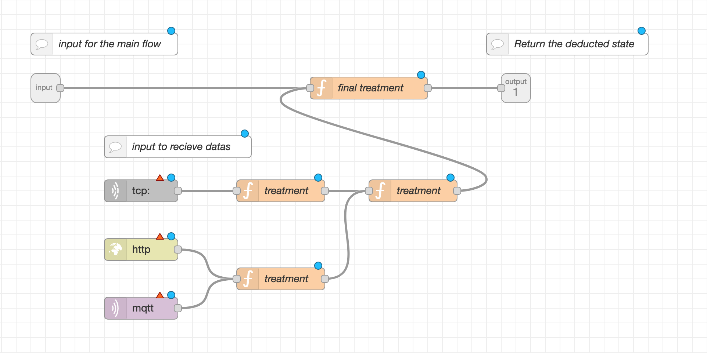

# Backend Node-RED

Node red is the core technology of this backend. It allows to create flows (a set of nodes linked together) to perform processing.


## The base

### the Nodes
** /!\ Here are only simplified explanations in order to give some explanation to understand the rest. [To know more about the functioning of node-red](https://nodered.org/docs/) **

Node-red works with a graph system: each intelligent part is a node that will perform a processing on the data it receives as input and return data as output. 
The data transmitted in the graph are called messages and are jsavascript objects. The information is usually found in message.payload. Here is an example of a message.payload:

```json
{
    "_msgid": "12345",
    "payload": {
        "Status of the LED" : 1,
        "Temperature" : "34°C"
    }
}

```
Each node is actually a javascript package that can have dependencies. Some of them are already implemented in node-red but it is possible to download them or to create them by yourself (like the database management neud that we have realized)
To make the analogy with classical programming, the nodes are simply functions and the flow is the main.js.

### The subflows
The flow can be transformed into nodes by creating sub flows. We create a flow for a certain task but instead of copying and pasting this flow every time we want to use it, we put it in a node that can be more easily implemented later. To make the analogy with classical programming, it would be a module.


## Our case
We use node-red as the processing center for all information received by the smart devices.No data processing is done in the server.
The main flow will be an api rest accessible by the server with the /api. 
Global Pricipe :


Each teacher will have a sub-flow in which he will collect the information from his devices, process them as he wants in order to return his state.


## teacher's sub-flow :

**input** 
the subflow must have 1 input that will be used to trigger the subflow when there is a call to /api/state. 
However, inside the subflow the teacher can put inputs to receive information from his devices (like an mqtt, http... input)

**output**
Each teacher's sub-flow must return their status in the form of a .payload message coded to look like this: 

```json
{
    "_msgid": "12345",
    "payload": {
        "professeurID" : 12,
        "state" : 1
    }
}
```
Each teacher can have as many states as they want. He will be able to assign to this status a corresponding message on his profile page (see back-frontend)



## Main flow :


**input** To trigger the calculation of the states at each /api/state

After starting the calculation of the states, the flow gathers them to put them in a message to be sent as a reply. **Since the message is sent once the calculation of the state by each subflow, a 'TimeOut' node should be implemnted to avoid that a subflow of a teacher too slow slows down all the other flows**.

**output** A .json that coressponding to all the states of all the teachers of the form: