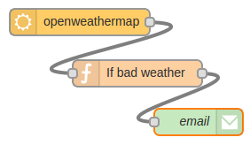
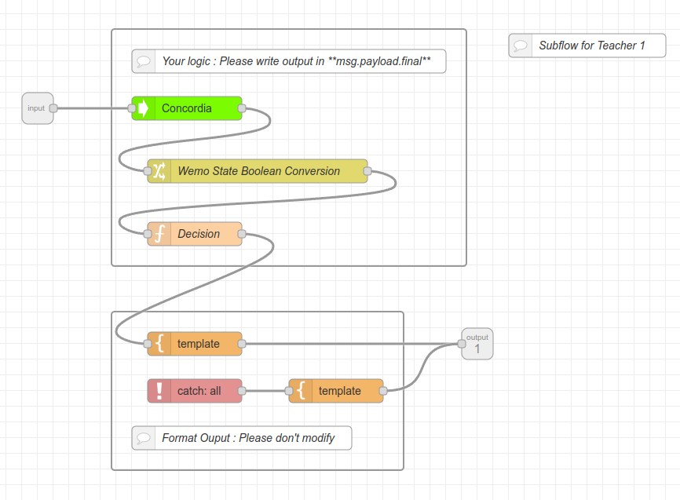
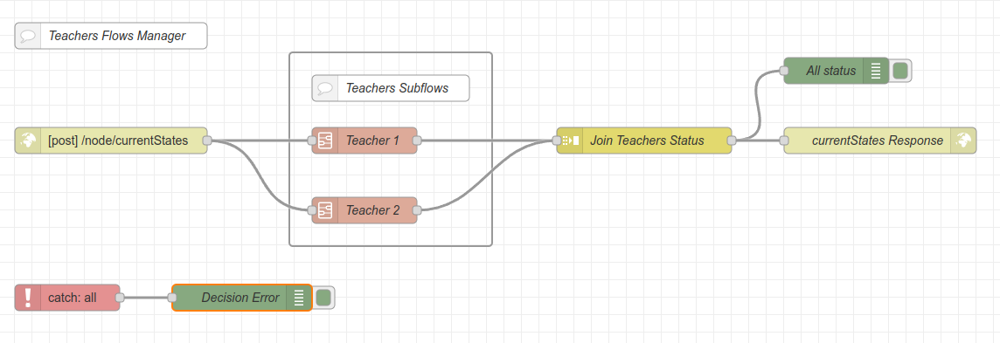

# Node-RED

Node red is the core technology of this backend. It allows to create flows (a set of nodes linked together) to perform processing.




## Basics

### The Nodes
:::warning
Here are only simplified explanations in order to give some guidelines to understand the rest. [To know more about the functioning of node-red](https://nodered.org/docs/)
:::

Node-red works with a graph system: each intelligent part is a node that will perform a processing on the data it receives as input and return data as output. 
The data transmitted in the graph are called messages and are jsavascript objects. The information is usually found in message.payload. Here is an example of a message.payload:

```json
{
    "_msgid": "12345",
    "payload": {
        "Status of the LED" : 1,
        "Temperature" : "34°C"
    }
}
```
Each node is actually a javascript package that can have dependencies. Some of them are already implemented in node-red but it is possible to download them or to create them by yourself (like the database management neud that we have realized)
To make the analogy with classical programming, the nodes are simply functions and the flow is the main.js.

### The subflows
The flow can be transformed into nodes by creating sub flows. We create a flow for a certain task but instead of copying and pasting this flow every time we want to use it, we put it in a node that can be more easily implemented later. To make the analogy with classical programming, it would be a module.


## Our case
We use node-red as the processing center for all information received by the smart devices.No data processing is done in the server.
The main flow will be an api rest accessible by the server with the /api. 
Global Principle :


Each teacher will have a sub-flow in which he will collect the information from his devices, process them as he wants in order to return his state.


## Teacher's subflow

**Input**

The subflow must have 1 input that will be used to trigger the subflow when there is a call to /api/state. 
However, inside the subflow the teacher can put inputs to receive information from his devices (like an mqtt, http... input)

**Output**

Each teacher's sub-flow must return their status in the form of a .payload message coded to look like this: 

```json
{
    "_msgid": "12345",
    "payload": {
        "fianl": {
            "professeurID" : 12,
            "state" : 1
        }
    }
}
```

Each teacher can have as many states as they want. He will be able to assign to this status a corresponding message on his profile page, see this [page](../backend/front-backend.md#be-able-to-match-a-specific-message-to-a-certain-state).

Here is an example of the organisation of a teacher's subflow:


And here is an example of the teacher subflow using the template :


## Main flow

**Input**

The calculation of the states are triggered at each [post]/node/currentstates from the Express server to the Node-Red server

After starting the calculation of the states, the flow gathers them to put them in a message to be sent as a reply. **Since the message is sent once the calculation of the state by each subflow, a 'TimeOut' node should be implemnted to avoid that a subflow of a teacher too slow slows down all the other flows**.

**Output** 
A .json that coressponding to all the states of all the teachers of the form:

```json
{
    "professor1" : 1,
    "professeur2" : 22,
    "professeur3" : 0,
    ...
}
```

Here is an example of the main flow with two teacher's subflows :



## Add a new Teacher Flow

If you are an admnistrator of the WIMP system and you want to add a teacher flow, what you need is to :

- Create a subflow for the teacher using the following Teacher's subflow template: 
    
    - Click on the menu burger in the right hand corner, then click on Subflows > Create a new Subflow

    - Click on the menu burger in the right hand corner, then click on Import, and paste the code of the Teacher's template. Then, click on import.


```json
[{"id":"005fb3c15057f302","type":"comment","z":"30c4fc871e6e7071","name":"Subflow for Teacher X","info":"","x":960,"y":100,"wires":[]},{"id":"710e3430d4a9e280","type":"group","z":"30c4fc871e6e7071","style":{"stroke":"#999999","stroke-opacity":"1","fill":"none","fill-opacity":"1","label":true,"label-position":"nw","color":"#a4a4a4"},"nodes":["3c0f887b4fb0ba63","11e61f6715fb34ac"],"x":354,"y":79,"w":452,"h":302},{"id":"3c0f887b4fb0ba63","type":"function","z":"30c4fc871e6e7071","g":"710e3430d4a9e280","name":"Decision","func":"const msgBkp = msg;\ntry {\n    //** WRITE YOUR LOGIC HERE **\n\n    // Example of logic\n    // if (msg.payload.state === true) {\n    //     msg.payload.final = 1;\n    // } else {\n    //     msg.payload.final = 0;\n    // }\n    // return msg;\n} catch (e) {\n    console.log(\"ERROR IN FLOW OF TEACHER \" + env.get(\"TEACHER_ID\") + \": \" + e);\n    return msgBkp;\n}","outputs":1,"noerr":0,"initialize":"","finalize":"","libs":[],"x":460,"y":340,"wires":[["0f247dee9b086374"]]},{"id":"11e61f6715fb34ac","type":"comment","z":"30c4fc871e6e7071","g":"710e3430d4a9e280","name":"Your logic : Please write output in **msg.payload.final**","info":"","x":580,"y":120,"wires":[]},{"id":"70e56e2b21733f79","type":"group","z":"30c4fc871e6e7071","style":{"stroke":"#999999","stroke-opacity":"1","fill":"none","fill-opacity":"1","label":true,"label-position":"nw","color":"#a4a4a4"},"nodes":["0f247dee9b086374","ccf8822056e292dc","561b6c548502c622","6c91e252aa21c287"],"x":354,"y":439,"w":372,"h":202},{"id":"0f247dee9b086374","type":"template","z":"30c4fc871e6e7071","g":"70e56e2b21733f79","name":"","field":"payload","fieldType":"msg","format":"handlebars","syntax":"mustache","template":"{\n    \"{{env.TEACHER_ID}}\": \"{{payload.final}}\"\n}","output":"json","x":460,"y":480,"wires":[[]]},{"id":"ccf8822056e292dc","type":"comment","z":"30c4fc871e6e7071","g":"70e56e2b21733f79","name":"Format Ouput : Please don't modify","info":"If msg.payload.final is not set,\nthen a default value \"\" will be set.","x":520,"y":600,"wires":[]},{"id":"561b6c548502c622","type":"catch","z":"30c4fc871e6e7071","g":"70e56e2b21733f79","name":"","scope":null,"uncaught":false,"x":460,"y":540,"wires":[["6c91e252aa21c287"]]},{"id":"6c91e252aa21c287","type":"template","z":"30c4fc871e6e7071","g":"70e56e2b21733f79","name":"","field":"payload","fieldType":"msg","format":"handlebars","syntax":"mustache","template":"{\n    \"{{env.TEACHER_ID}}\": \"\"\n}","output":"json","x":640,"y":540,"wires":[[]]}]
```

- Configure the Teacher's sublfow: 
    - Rename the subflow with the Teacher ID by clicking on the subflow name (which is "X" in the template).

    - Set the `TEACHER_ID` environment variable by clicking on "edit properties" button in the left-hand corner and replacing "X" the Teacher ID.

-  Click on `Deploy` in the right hand corner. You can deploy it even if it is empty, there will be no impact on the system since the subflow is not connected in the Teachers Flows Manager.

:::warning
The next steps must be done when the Teacher's subflow is functioning correctly.
:::

- Add the new Teacher's subflow in the Teachers Flows Manager:
    - Drag & Drop the new Teacher's subflow in the nods group `Teachers Subflows` of the flow.

    - Connect the output of the POST endpoint to the input of the new subflow.

    - Connect the output of the new subflow to the input of the node named `Join Teachers Status`.

    - Click on `Deploy` in the right hand corner and check that everthing is functioning correctly.

:::note
As a reminder, you can only use the `Debug` node in a flow (not in a subflow). Therefore, you can only use the debug node in the Teachers Flows Manager and not in a Teacher's subflow. If you want to debug a teacher subflow, we recommend to make a copy in a local flow to correct it in order not to disturb the organization of the system.
