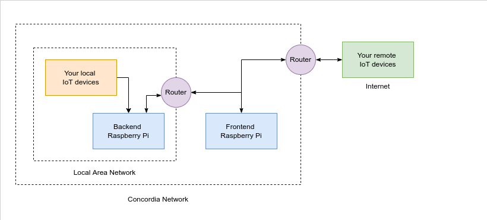

# Deployment Guide

This section will learn you how to deploy your WIMP system for your entity. 

## Requirements

To deploy you WIMP system, you will need at least :
- Two Raspeberry Pi or servers which can support Node-RED and ExpressAPI.
- A local network (LAN) for your device management and the backend support

The network configuration of your system must look like the following schema :

## Strategy

More precisely, each Raspberry Pi will support an Nginx reverse-proxy which will allow HTTPS support for the backend and the frontend of the WIMP system. Indeed, the backend and the frontend will be exposed on port 80 and 443 on each Raspberry Pi. All the requests on port 80 (HTTP) will be redirect on port 443 (HTTPS). Finally, all the Nginx reverse-proxy will forward the request to the Express API running on localhost on each Raspberry Pi.

Once your infrastrcuctre is ready, you can move on to configure it to support the WIMP system.